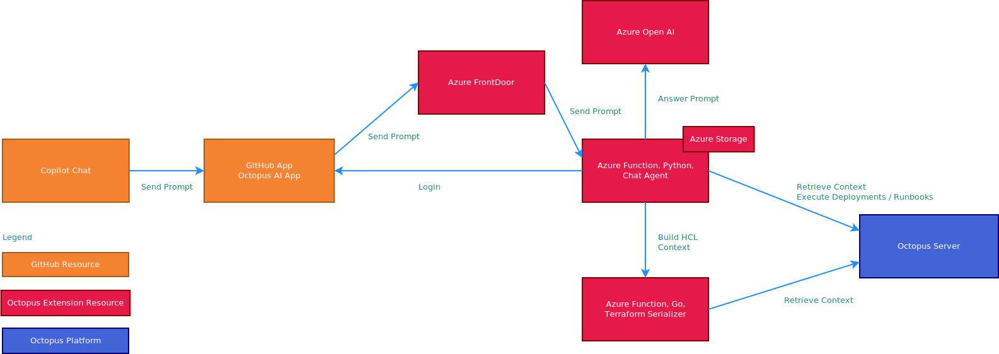

This project provides an agent for GitHub's Copilot that can query an Octopus
Server. It is deployed as an Azure functions app, and integrates with the
Azure OpenAI service.

# Documentation

View the documentation [here](https://octopus.com/docs/administration/copilot).

# Prompt Engineering Guide

View the [Wiki](https://github.com/OctopusSolutionsEngineering/OctopusCopilot/wiki/Prompt-Engineering-with-Octopus) for
a guide on prompt engineering with this agent.

# Creating a service account

This agent requires an account to interact with Octopus. This is best done with a
[service account](https://octopus.com/docs/security/users-and-teams/service-accounts).

To limit the agent's access, it is recommended that you create a team and role that has only read access to Octopus.

A sample Terraform configuration file has been provided to create a read-only service account, team, and role.

Save the
file [team.tf](https://github.com/OctopusSolutionsEngineering/OctopusCopilot/blob/main/octopus/serviceaccount/team.tf)
locally and apply it with the following commands (replacing the variables with your own values):

```shell
terraform init
terraform apply -var=octopus_server=https://yourinstance.octopus.app -var=octopus_api_key=API-XXXXXXXX -var=octopus_space_id=Spaces-x
```

This creates a service account, team, and user role called `Copilot`. The role includes permissions to view Octopus
resources, but not to modify them.

# Azure Function outbound IPs

The list of outbound IP addresses for the functions that make up this extension can be found
in [outboundips.txt](outboundips.txt). These IP addresses must be placed into an allowlist for any Octopus instance the
extension will interact with.

Note that Octopus cloud instances do not need to take any additional action to grant the extension access.

# Test web site

The primary interface for this agent is via the GitHub Copilot chat. This requires individual users to be invited to
the private beta.

We have a [test web site](https://aiagent.octopus.com/api/form) that responds to the same queries
as the chat interface. The web based interface is functionally equivalent to the Copilot chat interface in terms of
interacting with an Octopus server.

# Architecture diagram



# Code structure

This project is organized using the structure described
in [Design a DDD-oriented microservice](https://learn.microsoft.com/en-us/dotnet/architecture/microservices/microservice-ddd-cqrs-patterns/ddd-oriented-microservice).
It is not a strict implementation of the patterns described in that post, but follows it as closely as possible.

The application layer is found in the root of the project. These files expose the public surface area of the
application, be it a CLI interface or a web API.

The domain layer is found in the `domain` directory. This includes all the business logic.

The infrastructure layer is found in the `infrastructure` directory. This includes all the external integrations with
databases, logging platforms, and external APIs.

Tests are found in the `tests` directory.

# How to contribute

The most public way to contribute to this project is to build new "tools" (a fancy way of saying functions) that
OpenAI can use. To do this:

1. Create a new wrapper function in `domain/tools/wrapper`. Make sure the wrapper returns a function that
   includes the appropriate comments that OpenAI can read to understand the purpose of the function and the arguments.
2. Create a new callback function in `domain/tools/githubactions`. This
3. Add the function to the set of tools in the `build_form_tools()` function in `function_app.py`.
4. Typically, any new function requires calling the Octopus API. Functions for querying the Octopus API are defined in
   the `infrastructure/octopus.py` file.
5. Update the Terraform module in the `tests/terraform/space_population` folder to create a sample space which has the
   data your new function will query. This Terraform module is used to populate a sample Octopus instance used as part
   of the tests.
6. Create a new test case un `tests/live/octopus_test.py`. This test class has been configured to create a fresh
   instance of Octopus using TestContainers populated with the Terraform module created in step 4.

# Local testing

You can also optionally create a new tool and update the `build_tools()` function in the `main.py` file. The CLI
interface is mostly used for quick testing and is not expected to maintain a complete selection of tools. It is also
used to demonstrate how this application can be extended beyond platforms like Copilot.

To run the command line you need to set the following environment variables:

1. `OCTOPUS_CLI_API_KEY` - An Octopus API key
2. `OCTOPUS_CLI_SERVER` - The URL of the Octopus server
3. `OPENAI_API_KEY` - The key to access OpenAI
4. `OPENAI_ENDPOINT` - The OpenAI endpoint

You can then run the CLI with the following command:

```shell
python3 main.py --query "Show the projects from the Documentation space"
```

Octonaughts can see the `Octopus Copilot OpenAI` secure note in the password manager for the Open AI key and endpoint.

# Testing

The testing is broken down into 3 categories:

* Unit tests, mostly under `tests/domain`
* Infrastructure integration tests that:
    * Validate the ability to call an octopus server initialized with Test Containers in
      the `tests/infrastructure/octopus_infrastructure_test.py` file
    * Validate the ability to call the Azure Open AI service in the `tests/infrastructure/openai_infrastructure_test.py`
      file
    * Validate the ability to call the Azure Storage Service in
      the `tests/infrastructure/azure_storage_infrastructure_test.py` file
* End-to-end tests that validate the ability to call web endpoints exposed by the Azure Functions app in the
  `tests/application/copilot_chat.py` file

## Test Coverage


